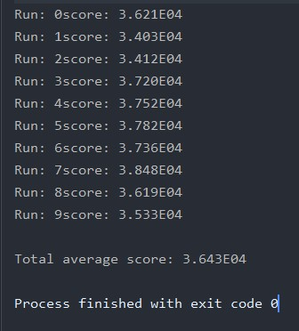

 

# Designing Intelligent Agents: Single Agent System

 

  
  

## Getting Started

- The java source code of the **agent** can be found [here](src/uk/ac/nott/cs/g53dia/agent/DemoLitterAgent.java).

- The **java classes** programmed for the functioning of the **agent** can be found in the [agent package](src/uk/ac/nott/cs/g53dia/agent).

- An improved version of this agent will interact with other agents in the [Multi-Agent Project](https://github.com/EdoardoCocconi/Designing-Intelligent-Agents_MultiAgent-System).

- The source code of the **environment** in which the agent operates can be found in the [library package](src/uk/ac/nott/cs/g53dia/library).

- To see the agent in action, run the [Simulator.java](src/uk/ac/nott/cs/g53dia/simulator/Simulator.java).

- To measure the agent performance over 10 runs, run the [Evaluator.java](src/uk/ac/nott/cs/g53dia/simulator/Evaluator.java).

 

## Environment

  The problem consists of a 2D environment, in which an agent must transport waste and recycling from bins to stations. The goal of the agent is to transport as much waste and recycling as possible in a fixed period of time.
    
  <ul>
    <li>The environment is an infinite 2D grid that contains randomly distributed recycling and waste bins, waste and recycling stations, and recharging points.</li>
    <li>The environment is an infinite 2D grid that contains randomly distributed recycling and waste bins, waste and recycling stations, and recharging points.</li>
    <li>Bins periodically generate tasks to transport a specified amount of recycling or waste (max 100 litres).</li>
    <li>Tasks persist until they are achieved (a bin has at most one task at any time).</li>
    <li>Recycling and waste stations can accept an infinite amount of recycling and waste respectively.</li>
    <li>The agent can recharge at a recharging point.</li>
    <li>The agent's battery capacity is 500.</li>
    <li>Recycling and waste must not be mixed – if the agent has loaded waste it must be taken to a waste station before it collects recycling, and if it has loaded.</li>
    <li>Recycling must be taken to a recycling station before waste is loaded.</li>
    <li>The agent can see any bins, stations and recharging points within 30 cells of its current position.</li>
    <li>If a bin is visible, the agent can see if it has a task, and if so, how much recycling or waste is to be disposed of.</li>
    <li>Move actions take one timestep and consume 1 unit of battery.</li>
    <li>Collecting recycling and waste from a bin and unloading recycling and waste at a station takes one timestep (and consumes no battery).</li>
    <li>The agent starts out at a recharging point with 500 units of battery and no recycling or waste.</li>
    <li>A run lasts 10,000 timesteps unless the agent runs out of battery, in which case the run is terminated.</li>
    <li>The success (score) of the agent is determined by the total amount of recycling and waste collected.</li>
  </ul>

 

## Architecture

  The agent has a reactive architecture with hierarchical control. The hierarchy is implemented in the Sense method of DemoLitterAgent as a series of if-conditions. The higher the priority the earlier the condition is checked. If a condition is met, the corresponding behavior is triggered. The behaviors are listed here from highest priority to lowest priority:
    
  <ul>
    <li><b>RechargeBehaviour:</b> if the agent is on the target RechargeStation perform a RechargeAction, otherwise MoveTowards RechargeStation.</li>
    <li><b>CollectBehaviour:</b> if the agent is on the target LitterBin perform a LoadAction, otherwise MoveTowards LitterBin.</li>
    <li><b>DisposeBehaviour:</b> if the agent is on the target Station perform a DisposeAction, otherwise MoveTowards Station.</li>
    <li><b>ExploreBehaviour:</b> If the agent is at distance <= 30 from the origin get away from the origin, else MoveTowards origin.</li>
  </ul>
    
  The Sense method receives percepts from 3 Sensors:
    
  <ul>
    <li><b>RechargeDetector:</b> detects recharge stations inside a radius that is related to how much battery the agent has already lost. If there are recharge stations in this radius, RechargeBehaviour is triggered.</li>
    <li><b>LitterDetector:</b> detects the bin with the highest litter over distance ratio within the specified field of view.</li>
    <li><b>StationDetector:</b> detects the closest station.</li>
  </ul>
    
  The sense method runs at every timestep inside senseAndAct and selects a Behaviour. If nothing is detected, the ExploreBehaviour is selected. The selected behaviors is carried out by the Act method inside senseAndAct.

 

## Why the agent architecture is appropriate for the project

  The chosen hierarchy is a successful representation of the priorities of the agent. In order: the agent preserves itself, completes tasks, disposes the litter once enough tasks have been completed, and moves if there is nothing to do in the current area.
    
  The chosen task is always the one that will allow the agent to perform the greatest amount of points in the shortest amount of time. This could be improved by a more far-sighted approach, but it would be less responsive to newly spawned tasks, exponentially more computationally expensive, and more time consuming to program. Instead, this simple approach is easy to debug, easy for a human to understand, and gives more time for perfecting and tuning the algorithms.
    
  This approach has the additional advantage that after some updates it can become the perfect starting point to implement multiple agents in the next project, which will be more computationally expensive.
   
  As will be explained in the "Chosing the bin" section of this README the agent is likely to complete a cluster of tasks before moving to the next cluster. If every high value task was surrounded by many low value tasks, the agent would not understand that it has to change cluster if the latter is too far away. Also, the agent exploits the fact that points are awarded only at task completion. If points were awarded for partial completion, the agent would have to be changed so it does not avoid partial completion.

 

## Mapping

  The agent does have an internal representation of the environment. The class that manages this internal representation is ExploredMap. The method updateMap adds the current view to a hash map with Point as key and Cell as value. This allows to add new tasks and unexplored regions to the map. updateMap is called at every timestep inside the senseAndAct method. The map allows the agent to know the location of the nearest explored recharge station at all times, even if it is outside its field of view. In the next project it might be used to communicate to other agents the location of clusters of tasks.

 

## Recharge

  <ul>
    <li>The agent immediately goes to recharge if moving by one more cell would make it impossible to reach the closest recharge point known to the agent.</li>
    <li>The agent immediately goes to recharge if the battery is between 90% and 50% and the distance to the recharge station is 3 or less than 3.</li>
    <li>The agent immediately goes to recharge if the battery is below 50% and the distance to the recharge station is 4 or less than 4. The battery will never arrive to 0% due to the first condition.</li>
    
  The agent does not recharge if the battery can last until the end of the simulation without doing so. This allows to maximize the total number of points.
    
  This is implemented in the isRechargeInRange method in the RechargeDetector class. The method outputs TRUE if a RechargeStation is present in the respective radius.

 

## Explore

  The initial intention of the project was to explore the environment first, so more tasks start spawning, and the agent can record the position of the bins. The agent would have moved inside the explored environment where the probability of a task being present is higher. However, this initial exploration either produces an environment that is too small or wastes to many timesteps.
    
  In the final version of the project, the exploration is only triggered when there is nothing else to do. During the exploration, the agent moves away from the origin if its distance from the origin is less than 30, and it gets closer to the origin when it is greater or equal to 30. The areas close to the origin have a higher probability to be already explored and therefore have a higher probability to contain more tasks over time.
    
  This is implemented in the ExploreBehaviour class.

 

## Choosing the bin

  The agent finds the task with the highest litter over distance ratio in the specified field of view. The field of view is inversely    proportional to the current litter capacity of the agent. If the agent is 90% full, the field of view is reduced by 90%. Therefore,     the agent won’t look for high value tasks that are far away because the agent could not complete them anyways. Instead, the agent       prefers to go to the tasks close to it that can be completed before going to the station.
    
  The bin with the highest litter over distance ratio is found by the readSensor method of the LitterDetector class. The readSensor       method is called in the sense method in DemoLitterAgent. When the field of view is so small that the agent does not see any task, or   when the agent is full, the CollectBehaviour does not run anymore.

 

## Chosing the station

  The agent goes to the closest station. This allows it to complete the current cluster of tasks before going to the next one. This is implemented in the readSensor method in the StationDetector class.

 

## Performance

 

 

Agent's average score over 10 runs: 3.643E04

 
 

> *©  2019  Edoardo  M.  Cocconi  All  Rights  Reserved*
